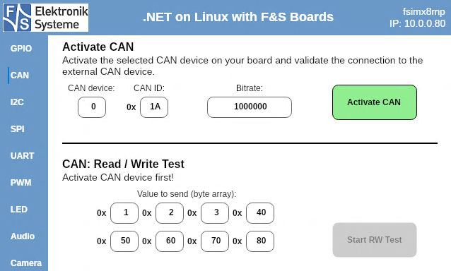
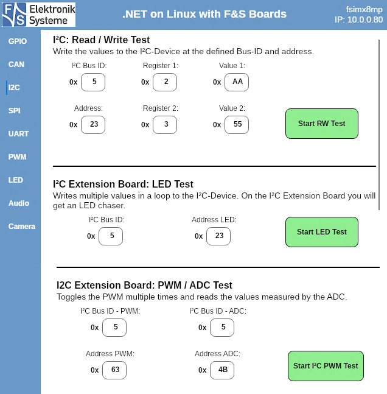

# .NET on Linux with F&S Boards

[](https://fs-net.de/en/)

This software demonstrates the possibilities of [dotnet on Linux](https://github.com/RDunkley/meta-dotnet-core).
FusDotnetDemo implements the [.NET IoT Libraries](https://github.com/dotnet/iot), which make it easy to use the hardware features of [F&S Boards](https://fs-net.de/en)).
The [UI](#avalonia-ui) is built with [Avalonia UI](https://www.avaloniaui.net/), so it is a multiplatform app and can be started on Linux as well as Windows (But mind that the hardware tests are designed to work on Linux only and will propably lead to crashes on Windows!).
If you want to see which interface demos are implemented in this app you can jump right to the [descriptions](#implemented-hardware-interfaces).

This software and the default values set in *boardvalues.json* are currently tested to work on a PicoCoreMX8MPr2. It should also run on other boards, however there are no default values set yet.

## Software Requirements

This software is targeting .NET 8.0.

### Linux

If you use Yocto, [meta-dotnet-core](https://github.com/RDunkley/meta-dotnet-core) might be helpful to add *.NET Core* and *Visual Studio Remote Debugger* to your Yocto Linux image.
Avalonia on Linux needs X11, Wayland might be supported in future versions.
For implementing audio with the Iot.Device.Media library, alsa-dev is needed.


## How to run this software on Linux

Compile the code, copy the binaries to your board and run following command in Linux to start the app. Adapt the path to the dll-file according to your setup:

```bash
dotnet FusDotnetDemo/FusDotnetDemo.dll
```

### Automation of the copy process

Included in this project is the PowerShell-Script *copy_debug_to_board.ps1*. This script copies the content of your local directory *.\bin\Debug\net8.0* to the board using SSH, excluding all runtimes that are not needed for execution on Linux.

**Change the IP address in the script to your board IP!**

If you use Visual Studio, you can execute this script as a "PostBuildEvent", defined in the file FusDotnetDemo.csproj:

```
<Target Name="PostBuild" AfterTargets="PostBuildEvent">
    <Exec Command="powershell.exe .\copy_debug_to_board.ps1" />
  </Target>
```

If enabled, the files in your Debug directory will automatically be copied to the board whenever you create a new build!


## Avalonia UI

The App is intended to be run in fullscreen (*weston kiosk-shell*), for this reason window decorations etc. are disabled. If you want FusDotnetDemo to behave like a regular windowed program, change some lines in */Views/Mainwindow.axaml*:

```axaml
<Window...

    SystemDecorations="BorderOnly"
    CanResize="False"
    ExtendClientAreaToDecorationsHint="False"
    ExtendClientAreaChromeHints="NoChrome"
    ExtendClientAreaTitleBarHeightHint="0"

    ...>
```


## Implemented Hardware Interfaces

All interface demos have default values already set, for example GPIO pins, device IDs, register addresses etc. These are defined in *boardvalues.json*. FusDotnetDemo checks your board type on startup and selects the values accordingly.
You can see your board type / platform with this command in Linux:

```bash
cat /sys/bdinfo/platform
```

You can find a documentation for your board and it's interface connectors at [fs-net.de](https://fs-net.de/en/embedded-modules/product-overview/). Select your board and look for the *Hardware Documentation* and *GPIO Reference Card*.
For some boards I have added files to this repo which show you the connector pins corresponding to the default values in *boardvalues.json*. You can find these files at *Assets/[BOARDTYPE].md*


### GPIO


You can find the GPIO Pin number in the *GPIO Reference Card* for your board on the [F&S Website](https://fs-net.de/en/embedded-modules/product-overview/) in column */sys/class/gpio/gpio#*. 


### CAN



For this test you need a second board which will receive the CAN signal and send a response to your board.
Connect second board: CAN_L to CAN_L & CAN_H to CAN_H

#### Activate CAN

CAN needs to be activated in Linux to run this test.
However, on your board which runs this app this will be done through this software.
On the second board which receives and responds to the CAN signal, the activation must be done manually. Run the following comand under Linux to activate can0:

```bash
ip link set can0 up type can bitrate 1000000 && ifconfig can0 up
```

#### Read / Write Test

Run this command on external Linux device while CAN test in this app is running to return the received value:

```bash
STRING=$(candump can0 -L -n1 | cut -d '#' -f2) && cansend can0 01b#${STRING}
```


### I2C



Bus for "I2C Extension Board" must be activated in the Device Tree of your board.
If you don't have the F&S I2C Extension Board, at least the Read / Write test should be adaptable to your setup. The "I2C Extension Board" has LEDs and PWM / ADC that are used in the other tests.
For the PWM / ADC Test, connect the pins for PWM and ADC with each other!


### SPI


You need an external SPI device connected to your board.


### UART


First, let the app find all available Serial Ports on your board. Select sender and receiver port and connect the corresponding pins on your board to run the Loopback Test.


### PWM


Connect an LED to your board (or use a voltmeter to measure the voltage increase).
The first test will increase the voltage from 0V to 3.3V over the defined timespan, in the second test you can change the voltage using the slider.


### LED


Find all available LEDs connected to your board. This will also find for example the LED for CapsLock on a keyboard connected via USB.
Select an LED and let it blink.


### Audio


**Include alsa-dev to your yocto release!**

If you use the headphone jack on your board or baseboard, it should be automatically unmuted for playback. When using lineout, you propably have to unmute manually, using:

```bash
alsamixer
```


### Camera


You can use a webcam connected via USB.


## Further Information

* [F&S Product Overview](https://fs-net.de/en/embedded-modules/product-overview/) - See all available boards, get hardware documentations for your board
* [DOTNET on F&S Boards](https://fs-net.de/assets/download/docu/common/en/DOTNET%20on%20FS%20Boards.pdf) - Find information how to get startet with .NET on F&S Boards
* [Official Microsoft IoT Documentation](https://docs.microsoft.com/dotnet/iot/) - Concepts, quickstarts, tutorials and API reference documentation.
* [Avalonia  UI Documentation](https://docs.avaloniaui.net/) - All infos needed to build a cross-platform app UI


## Copyright

Copyright (C) 2024 [F&S Elektronik Systeme GmbH](https://fs-net.de/)