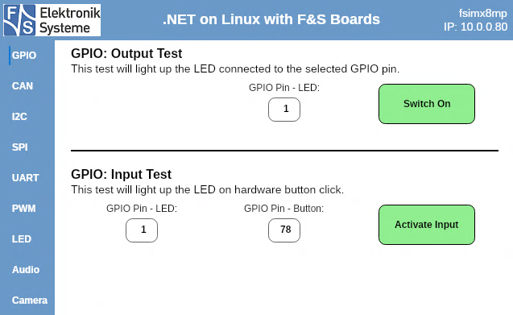
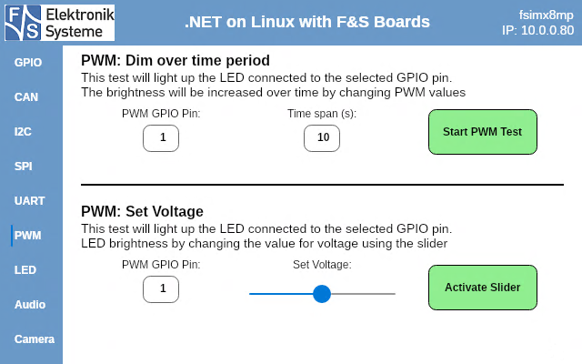
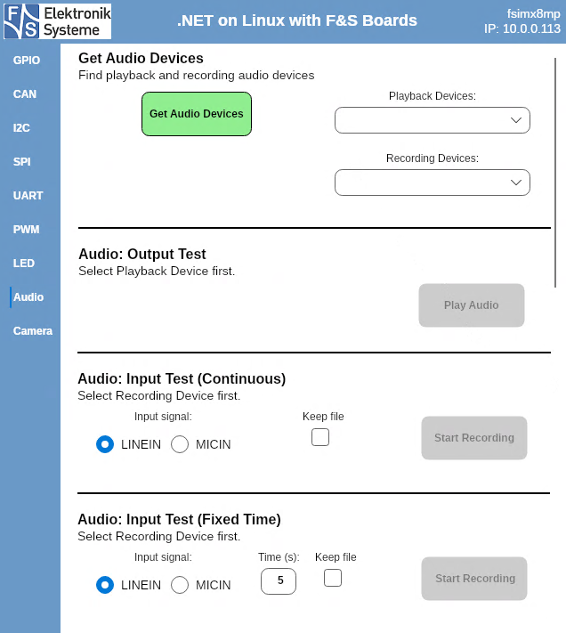
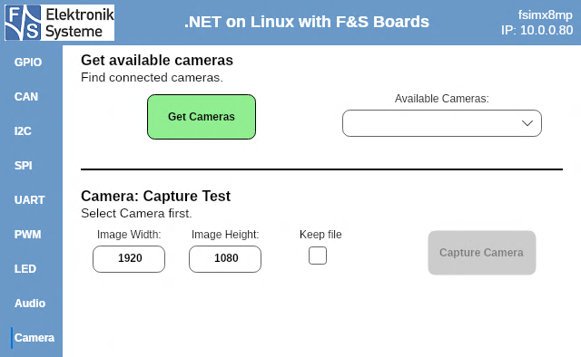

# .NET on Linux with F&S Boards

[](https://fs-net.de/en/)

This software demonstrates the possibilities of [dotnet on Linux](https://github.com/RDunkley/meta-dotnet-core).
The software implements the [.NET IoT Libraries](https://github.com/dotnet/iot), which make it easy to use the hardware features of [F&S Boards](https://fs-net.de/en)).
The [UI](#avalonia-ui) is built with [Avalonia UI](https://www.avaloniaui.net/), so it is a multiplatform app and can be started on Linux as well as Windows (on Windows, at least the program starts. The hardware tests are designed to work on Linux only and will propably lead to crashes on Windows!).
If you want to see which interface demos are implemented in this app you can jump right to the [descriptions](#implemented-hardware-interfaces).


## Software Requirements

This software is targeting .NET 8.0.

### Linux

If you use Yocto, [meta-dotnet-core](https://github.com/RDunkley/meta-dotnet-core) might be helpful to add .NET Core and Visual Studio Remote Debugger to your Yocto Linux image.
Avalonia on Linux needs X11, Wayland might be supported in future versions.
For implementing audio with the Iot.Device.Media library, alsa-dev is needed.

### Installed NuGet Packages

These packages are already included in this project, but you will need them for creating your own apps.

#### Device Bindings

```shell
dotnet add package System.Device.Gpio --version 3.1.0
dotnet add package Iot.Device.Bindings --version 3.1.0
dotnet add package System.IO.Ports --version 8.0.0
```

#### User Interface

```shell
dotnet add package Avalonia --version 11.0.10
dotnet add package Avalonia.Desktop --version 11.0.10
dotnet add package Avalonia.Diagnostics --version 11.0.10
dotnet add package Avalonia.Fonts.Inter --version 11.0.10
dotnet add package Avalonia.ReactiveUI --version 11.0.10
dotnet add package Avalonia.Themes.Fluent --version 11.0.10
```


## How to run this software on Linux

Compile the code, copy the binaries to your board and run following command in Linux to start the app. Use a serial terminal like TeraTerm or SSH in PowerShell to start the app from your development machine. Adapt the path to the dll-file according to your setup.

```bash
dotnet FusDotnetDemo/FusDotnetDemo.dll
```

### Automation of the copy process

Included in this project is the PowerShell-Script *copy_debug_to_board.ps1*. This script copies the content of your local directory *.\bin\Debug\net8.0* to the board using SSH, excluding all runtimes that are not needed for execution on Linux.

**Change the IP address in the script to your board IP!**

If you use Visual Studio, you can execute this script as a "PostBuildEvent", defined in the file FusDotnetDemo.csproj:

```
<Target Name="PostBuild" AfterTargets="PostBuildEvent">
    <Exec Command="powershell.exe .\copy_debug_to_board.ps1" />
  </Target>
```

If enabled, the files in your Debug directory will automatically be copied to the board whenever you create a new build!


## Remote Desktop using RDP

With RDP, you can control the Demo-App from your development machine while it is running on your Linux-Board, without the need of a physical display connected to the board.

### Generate keys

First, you need to generate keys in Linux, this is only needed to be done once:

```bash
cd /etc/freerdp/keys/
openssl genrsa -out tls.key 2048
openssl req -new -key tls.key -out tls.csr
openssl x509 -req -days 365 -signkey tls.key -in tls.csr -out tls.crt
```

If '/etc/freerdp/keys/' does not exist on your board, first create it and continue with the above commands.

### Start Display Server on Startup

The display server won't start automatically if no physical display is connected to your board. This can be changed by editing weston.ini:

```bash
vi /etc/xdg/weston/weston.ini
```

Under [screen-share], this line is by default uncommented:

```
#start-on-startup=true
```

Remove the '#', save weston.ini and reboot.

### Start RDP server

To start RDP in Linux you can run this command:

```bash
/usr/bin/weston --backend=rdp-backend.so --shell=kiosk-shell.so --no-clients-resize --rdp-tls-cert=/etc/freerdp/keys/tls.crt --rdp-tls-key=/etc/freerdp/keys/tls.key
```

### Start App using RDP

If you have no physical display connected to your board, using only RDP, you can start the app as usual:

```bash
dotnet FusDotnetDemo/FusDotnetDemo.dll
```

If you have a physical display and RDP connected, you must define on which display the app should run, default is the physical display.
To start the app on RDP, use this command:

```bash
WAYLAND_DISPLAY=wayland-1 DISPLAY=:1 dotnet /home/root/IoTLib_Test/IoTLib_Test.dll
```


## Remote Debugging

Using Visual Studio on Windows, a simple solution for remote debugging on your Linux board is to use the option "Attach To Process".
* Start the app on your board as [explained](#how-to-run-this-software-on-linux).
* Now you can select "Attach To Process" in Visual Studio (or use the shortcut: Strg + Alt + P)
    * Select "Connection Type": SSH
    * "Connection Target": your board IP
    * If you are connected, find the process "dotnet" in the list of available processes
    * Select the process, click "Attach"
    * Debug as usual


## Avalonia UI

To make this application work on different platforms, it is important to adapt Program.cs. For Linux you have to set a default font, otherwise the software won't start.

UI Styles are defined globally in */Views/AppStyles.axaml*.

The App is intended to be run in fullscreen / weston kiosk-shell, for this reason window decorations etc. are disabled. If you want FusDotnetDemo to behave like a regular windowed program, change some lines in */Views/Mainwindow.axaml*:

```axaml
<Window...

    SystemDecorations="BorderOnly"
    CanResize="False"
    ExtendClientAreaToDecorationsHint="False"
    ExtendClientAreaChromeHints="NoChrome"
    ExtendClientAreaTitleBarHeightHint="0"

    ...>
```


## Implemented Hardware Interfaces

All interface demos have default values already set, for example GPIO pins, device IDs, register addresses etc.
These default values are meant to be used with the [PicoCoreMX8MPr2, Rev1.10](https://www.fs-net.de/assets/download/docu/PicoCore/PicoCoreMX8MP_eng.pdf). In [this document](Assets/pcmx8mpr2.md) all hardware pins to be used with the default values are listed!
If you use any other board, the default values are propably not working. Find your needed values in the [documentation for your board](https://www.fs-net.de/en/embedded-modules/product-overview/).


### GPIO




### CAN


For this test you need a second board which will receive the CAN signal and send a response to your board.
Connect second board: CAN_L to CAN_L & CAN_H to CAN_H

#### Activate CAN

CAN needs to be activated in Linux to run this test.
However, on your board which runs this app this will be done through this software.
On the second board which receives and responds to the CAN signal, the activation must be done manually. Run the following comand under Linux to activate can0:

```bash
ip link set can0 up type can bitrate 1000000 && ifconfig can0 up
```

#### Read / Write Test

Run this command on external Linux device while CAN test in this app is running to return the received value:

```bash
STRING=$(candump can0 -L -n1 | cut -d '#' -f2) && cansend can0 01b#${STRING}
```


### I2C


Bus for "I2C Extension Board" must be activated in the Device Tree of your board.
If you don't have the F&S I2C Extension Board, at least the Read / Write test should be adaptable to your setup. The "I2C Extension Board" has LEDs and PWM / ADC that are used in the other tests.
For the PWM / ADC Test, connect the pins for PWM and ADC!


### SPI


You need an external SPI device connected to your board.


### UART


First, let the app find all available Serial Ports on your board. Select sender and receiver port and connect the corresponding pins on your board to run the Loopback Test.


### PWM



Connect an LED to your board (or use a voltmeter to measure the voltage increase).
The first test will increase the voltage from 0V to 3.3V over the defined timespan, in the second test you can change the voltage using the slider.


### LED


Find all available LEDs connected to your board. This will also find for example the LED for CapsLock on a keyboard connected via USB.
Select an LED and let it blink.


### Audio



**Include alsa-dev to your yocto release!**

If you use the headphone jack on your board or baseboard, it should be automatically unmuted for playback. When using lineout, you propably have to unmute manually, using:

```bash
alsamixer
```


### Camera



You can use a webcam connected via USB.


## Further Information

* [F&S Product Overview](https://fs-net.de/de/embedded-module/produktuebersicht/) - See all available boards, get hardware documentations for your board
* [Official Microsoft IoT Documentation](https://docs.microsoft.com/dotnet/iot/) - Concepts, quickstarts, tutorials and API reference documentation.
* [Avalonia  UI Documentation](https://docs.avaloniaui.net/) - All infos needed to build a cross-platform app UI


## Copyright

Copyright (C) 2024 [F&S Elektronik Systeme GmbH](https://fs-net.de/)